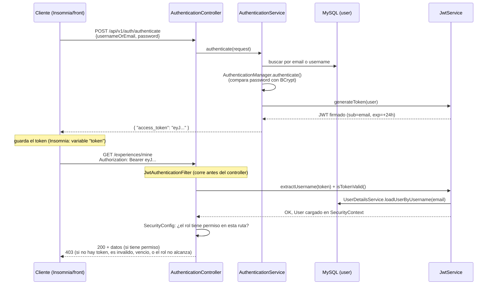

# eTrip — Backend

Marketplace de **experiencias turísticas locales** (clases de cocina, tours de estadios, caminatas
urbanas, eventos gastronómicos) al estilo *Airbnb Experiences*. TPO grupal de Aplicaciones
Interactivas (UADE, 2º cuatrimestre 2026).

La consigna original de la cátedra es un e-commerce genérico; el equipo la adaptó al dominio de
experiencias turísticas.

## Flujo de la aplicación

```
Usuario  →  Carrito  →  Confirmación de reserva  →  Bookings / Vouchers
```

Un usuario publica una **experiencia** dentro de una **categoría**. Cada experiencia tiene
**sesiones/turnos** (fecha + capacidad + cupos). Otro usuario arma un **carrito** con sesiones,
opcionalmente aplica un **cupón de descuento**, y al confirmar se generan las **reservas
(bookings)** con su código de voucher, descontando los cupos de cada sesión.

No se usa el concepto de "orden de compra" como algo separado de cara al usuario: el carrito se
confirma directamente en reservas (`Order` existe internamente como comprobante que agrupa los
vouchers).

## Stack

- Java 17 + Spring Boot 3.1.11
- Spring Data JPA / Hibernate
- MySQL 8
- Spring Security + JWT (`JwtAuthenticationFilter` + `SecurityFilterChain`)
- Lombok
- Maven (wrapper incluido: `./mvnw`)

## Arquitectura

- **Controller → Service → Repository.** Sin lógica de negocio en los controllers.
- Toda la validación vive en los `*ServiceImpl` (el proyecto no usa `spring-boot-starter-validation`
  / `@Valid`, es validación manual, a propósito, para no sumar una dependencia más).
- Los endpoints exponen **DTOs** de request/response, nunca las entidades.
- Inyección de dependencias por constructor (`@RequiredArgsConstructor`).
- Manejo de errores con excepciones *checked* anotadas con `@ResponseStatus`
  (`ResourceNotFoundException` → 404, `BadRequestException` → 400, `ForbiddenException` → 403,
  `CategoryDuplicateException` → 400).
- Roles: enum `Role` (`CLIENTE`, `ADMIN`) como campo de `User`. La autorización por ruta se hace
  en `SecurityConfig` con `hasAnyAuthority(Role.X.name())`; los chequeos más finos (dueño vs. no
  dueño, auto-asignación de rol, etc.) viven en el service.
- Paginación con `Page`/`PageRequest` de Spring Data en casi todos los listados; si no se mandan
  `page`/`size` se devuelve todo en una sola página (para no romper el flujo de quien todavía no
  implementó paginado del lado del front).

## Modelo de dominio

| Entidad | Tabla | Campos clave | Relaciones |
|---|---|---|---|
| `User` | `user` | `email` (único), `displayUsername` (columna `username`, único), `password`, `firstName`, `lastName`, `role` | 1—N `Experience` (publisher), 1—N `Order`, 1—1 `Cart` |
| `ExperienceCategory` | `experience_categories` | `name` (único), `description` | 1—N `Experience` |
| `Experience` | `experiences` | `title`, `description`, `price`, `discountPercentage` (nullable), `location` | N—1 `ExperienceCategory`, N—1 `User` (publisher), 1—N `ExperienceImage`, 1—N `ExperienceSession`, 1—N `Review` |
| `ExperienceImage` | `experience_images` | `image` (`byte[]`/`LONGBLOB`), `position` | N—1 `Experience` |
| `ExperienceSession` | `experience_sessions` | `startsAt`, `endsAt`, `capacity`, `availableSeats` | N—1 `Experience`, 1—N `Booking` |
| `Cart` | `cart` | — | 1—1 `User`, 1—N `CartItem` |
| `CartItem` | `cart_item` | `quantity` | N—1 `Cart`, N—1 `ExperienceSession` |
| `DiscountCoupon` | `discount_coupon` | `code` (único), `percentage`, `validFrom`, `validUntil`, `active` | 1—N `Order` |
| `Order` | `orders` | `createdAt`, `subtotal`, `discountAmount`, `total` | N—1 `User`, N—1 `DiscountCoupon` (opcional), 1—N `Booking` |
| `Booking` | `booking` | `voucherCode` (`ETRIP-XXXXXXXX`), `quantity`, `createdAt` | N—1 `Order`, N—1 `ExperienceSession` |
| `Review` | `review` | `rating` (1-5), `comment`, `createdAt` | N—1 `User`, N—1 `Experience` |

Notas:
- El precio final que paga el comprador sale de `Experience.getEffectivePrice()`
  (`price * (1 - discountPercentage/100)`, o `price` si no hay descuento) — lo usa
  `ExperienceResponseDTO.finalPrice`, el carrito y el checkout, así el número es siempre el mismo
  en los tres lugares.
- `User.displayUsername` se llama así (no `username`) porque `UserDetails.getUsername()` ya existe
  y debe devolver el **email** (lo usa Spring Security para recargar el usuario en cada request);
  un campo literal `username` se hubiera pisado con ese método. Mapea igual a la columna
  `username` de la tabla.
- Las fotos de una experiencia son una entidad aparte (`ExperienceImage`, `cascade = ALL,
  orphanRemoval = true`) y no una sola columna, porque la consigna pide "una o más" fotos por
  experiencia.

## Cómo correr

1. Tener MySQL 8 corriendo en `localhost:3306`.
2. Crear la base (si no existe):
   ```sql
   CREATE DATABASE etrip_db CHARACTER SET utf8mb4 COLLATE utf8mb4_unicode_ci;
   ```
3. Ajustar usuario/contraseña en [`src/main/resources/application.properties`](src/main/resources/application.properties)
   si hace falta. También se puede sobreescribir sin tocar el archivo con variables de entorno
   `DB_USER` y `DB_PASSWORD`.
4. Levantar:
   ```bash
   ./mvnw spring-boot:run
   ```
5. La API queda en `http://localhost:4002`. Hibernate crea/actualiza las tablas al arrancar
   (`spring.jpa.hibernate.ddl-auto=update`).

### Autenticación

```bash
# Registro (pide username, ademas de nombre/apellido/mail/contraseña)
curl -X POST http://localhost:4002/api/v1/auth/register \
  -H 'Content-Type: application/json' \
  -d '{"username":"anap","firstname":"Ana","lastname":"Perez","email":"ana@test.com","password":"pass1234"}'

# Login: usernameOrEmail acepta tanto el username como el email
curl -X POST http://localhost:4002/api/v1/auth/authenticate \
  -H 'Content-Type: application/json' \
  -d '{"usernameOrEmail":"ana@test.com","password":"pass1234"}'
```

Ambos devuelven `{ "access_token": "<JWT>" }`. Ese token va en el header
`Authorization: Bearer <JWT>` en todos los endpoints de abajo. `register` siempre crea rol
`CLIENTE` (el campo `role` en el body, si lo mandás, se ignora); para tener un `ADMIN` hay que
`UPDATE user SET role='ADMIN' WHERE email=...` a mano en MySQL, o pedirle a otro ADMIN que use
`PATCH /users/{id}/role`. Ver la sección **JWT y autenticación** más abajo para el detalle de cómo
viaja y se valida el token en cada request.

## JWT y autenticación

Piezas involucradas (todas en `controllers/config/` y `service/`):

| Archivo | Rol |
|---|---|
| `JwtService` | Genera y valida el JWT (firma HMAC-SHA con `application.security.jwt.secretKey`, expira a las 24hs por `application.security.jwt.expiration`). |
| `AuthenticationService` | `register`/`authenticate`: valida datos, encripta la contraseña (`BCryptPasswordEncoder`), le pide el token a `JwtService`. |
| `ApplicationConfig` | Define el `UserDetailsService` (busca `User` por email), el `AuthenticationProvider` (`DaoAuthenticationProvider`) y el `PasswordEncoder`. |
| `JwtAuthenticationFilter` | Filtro que corre en **cada request**: si hay header `Authorization: Bearer ...`, extrae el token, lo valida y carga el usuario en el `SecurityContext`. |
| `SecurityConfig` | Define qué rutas son públicas y qué rol necesita cada una (`hasAnyAuthority(...)`). |

### Qué hay adentro del token

El JWT es un string en 3 partes (`header.payload.signature`). El `payload` de este proyecto tiene:
- `sub` (subject): el **email** del usuario (aunque hayas hecho login con `username`, el token
  siempre guarda el email — es lo que usa `UserDetailsService` para recargar el usuario en cada
  request).
- `iat` / `exp`: fecha de emisión y de expiración (24hs después).

El **rol no viaja en el token**: en cada request, `JwtAuthenticationFilter` vuelve a buscar al
`User` en la base por email y usa `user.getRole()` fresco. Por eso, si un ADMIN te cambia el rol
con `PATCH /users/{id}/role`, no hace falta pedir un token nuevo — el próximo request ya ve el rol
actualizado (el token viejo sigue siendo válido, solo cambia lo que autoriza).

### Flujo: login → request autenticado



### Por qué un `403` y no un `401`

Este proyecto no tiene una `AuthenticationEntryPoint` custom, así que Spring Security devuelve
**`403 Forbidden`** tanto si falta el token / está vencido / es inválido, como si el rol no
alcanza para esa ruta. No hay forma de distinguir "no estás logueado" de "no tenés permiso" solo
mirando el código HTTP — hay que fijarse en el mensaje del body o probar de nuevo con un login
fresco. Es la causa más común de 403 "misteriosos" al usar Insomnia: **el `token` del
environment está vacío o vencido**, no un bug del endpoint.

## Módulos implementados

| Módulo | Recursos | Estado |
|---|---|---|
| Catálogo | categorías, experiencias, fotos, descuento por producto | ✅ |
| Sesiones / Turnos | cupos y horarios por experiencia | ✅ |
| Carrito | armado del carrito, validación de stock | ✅ |
| Reservas y cupones | checkout, vouchers, cupones de descuento globales | ✅ |
| Usuarios y perfil | perfil propio/ajeno, administración de roles | ✅ |
| Reseñas | rating + comentario por experiencia | ✅ |

Login y registro ya venían resueltos en el proyecto base de la cátedra. El proyecto base también
traía un ejemplo genérico de e-commerce (`Product` / `Category` / `CategoriesController`); se
eliminó porque el dominio real de eTrip usa `Experience` / `ExperienceCategory`.

## Flujos principales

**Anfitrión publica y gestiona:**
```
register/authenticate → POST /experience-categories (si no existe la que necesita)
  → POST /experiences (multipart, 1+ fotos) → PATCH /experiences/{id}/discount (opcional)
  → POST /experience-sessions (una o mas por experiencia, con capacidad)
  → GET /experiences/mine (ver lo que publiqué) → GET /bookings/sales (ver quién me reservó)
```

**Comprador busca, reserva y opina:**
```
register/authenticate → GET /experiences?...filtros (categoría/precio/ubicación/fecha/ofertas)
  → GET /experiences/{id} (detalle: fotos + descripción + sesiones disponibles)
  → POST /carts/items (valida stock/cupos)
  → GET /discount-coupons/validate?code= (opcional, antes de pagar)
  → POST /orders (checkout: calcula total con descuentos, genera bookings + vouchers,
    descuenta cupos, vacía el carrito)
  → GET /orders, GET /bookings (mis compras/reservas) → POST /reviews (una por experiencia)
```

**Administración:**
```
authenticate (con un usuario ya promovido a ADMIN por SQL)
  → GET /users (listar cuentas) → PATCH /users/{id}/role (asignar permisos)
  → POST/PUT/DELETE /discount-coupons (gestión de cupones globales)
```

---

## Endpoints — Categorías de experiencias

Base: `/experience-categories` · Requiere rol `CLIENTE` o `ADMIN`.

| Método | Ruta | Descripción |
|---|---|---|
| `GET` | `/experience-categories?page=&size=` | Lista paginada. Sin `page`/`size` devuelve todo. |
| `GET` | `/experience-categories/{id}` | Categoría por id. `404` si no existe. |
| `POST` | `/experience-categories` | Crea. Body: `{ "name", "description" }`. |
| `PUT` | `/experience-categories/{id}` | Actualiza `name` / `description`. |
| `DELETE` | `/experience-categories/{id}` | Elimina. `400` si tiene experiencias asociadas. |

**Validaciones:** `name` obligatorio y no vacío (`400`); `name` único → `400`
(`CategoryDuplicateException`).

## Endpoints — Experiencias

Base: `/experiences` · Requiere rol `CLIENTE` o `ADMIN`.

| Método | Ruta | Descripción |
|---|---|---|
| `GET` | `/experiences?page=&size=&...` | Lista paginada con filtros (ver abajo). |
| `GET` | `/experiences/mine?page=&size=` | Mis experiencias publicadas (modo anfitrión). |
| `GET` | `/experiences/{id}` | Experiencia por id. `404` si no existe. |
| `POST` | `/experiences` | Crea. `multipart/form-data`: parte `experience` (JSON) + una o más partes `images` (archivos, **al menos 1 obligatoria**). |
| `PUT` | `/experiences/{id}` | Actualiza. `multipart/form-data`: `experience` (JSON) + `images` (opcional; si no viene, mantiene las fotos actuales; si viene, **reemplaza todo el set**). Solo el **dueño** o un **ADMIN**. |
| `PATCH` | `/experiences/{id}/discount` | Descuento individual del producto. Body: `{ "discountPercentage": 20 }` (`0` o vacío = sin descuento). Solo el **dueño** o un **ADMIN**. `0 <= x < 100`, sino `400`. |
| `DELETE` | `/experiences/{id}` | Elimina. Solo el **dueño** o un **ADMIN**. `400` si tiene sesiones asociadas (las fotos se borran solas por `orphanRemoval`). |

**Filtros de `GET /experiences`** (todos opcionales, se combinan con AND, `JpaSpecificationExecutor`
+ `ExperienceSpecifications`):

| Param | Efecto |
|---|---|
| `categoryId` | Categoría exacta. `404` si la categoría no existe. |
| `title` | Coincidencia parcial (case-insensitive) en el título. |
| `location` | Coincidencia parcial (case-insensitive) en la ubicación. |
| `minPrice` / `maxPrice` | Rango de precio. `minPrice > maxPrice` → `400`. |
| `publisherId` | Experiencias de un anfitrión puntual. |
| `onlyDiscounted` | `true` = solo experiencias con descuento de producto activo. |
| `dateFrom` / `dateTo` | Experiencias con **al menos una sesión** con `startsAt` en ese rango (ISO `2027-06-15T10:00:00`). `dateFrom > dateTo` → `400`. |

**Body de `experience` (parte JSON):**
```json
{ "title": "Pastas caseras", "description": "Amasado y salsa", "price": 5000, "location": "Palermo", "categoryId": 1 }
```

**Reglas de negocio:**
- `title` obligatorio, `price` > 0, `categoryId` obligatorio, al menos 1 foto no vacía → si no, `400`.
- La categoría debe existir → si no, `404`.
- El **publisher se toma del usuario autenticado** (JWT), no de un id en el body.
- `update` / `delete` / `discount`: solo el usuario que publicó la experiencia o un `ADMIN` (`403` en otro caso).
- Las fotos se guardan como `byte[]` (una fila `ExperienceImage` por foto) y se devuelven como
  Base64 en `ExperienceResponseDTO.imagesBase64` (lista, en el orden en que se cargaron).
- `discountPercentage` afecta `finalPrice` en la respuesta y el precio que se usa al confirmar la
  reserva (`POST /orders`).

**Ejemplo de creación (con 2 fotos):**
```bash
curl -X POST http://localhost:4002/experiences \
  -H "Authorization: Bearer $TOKEN" \
  -F 'experience={"title":"Pastas caseras","price":5000,"location":"Palermo","categoryId":1};type=application/json' \
  -F 'images=@foto1.png;type=image/png' \
  -F 'images=@foto2.png;type=image/png'
```

## Endpoints — Sesiones / Turnos

Base: `/experience-sessions` · Requiere rol `CLIENTE` o `ADMIN`.

| Método | Ruta | Descripción |
|---|---|---|
| `GET` | `/experience-sessions?page=&size=&experienceId=` | Lista paginada (opcional filtrar por experiencia). |
| `GET` | `/experience-sessions/experience/{experienceId}` | Sesiones de una experiencia. |
| `GET` | `/experience-sessions/{sessionId}` | Sesión por id. `404` si no existe. |
| `POST` | `/experience-sessions` | Crea. Body: `{ "experienceId", "startsAt", "endsAt", "capacity" }`. |
| `PUT` | `/experience-sessions/{sessionId}` | Actualiza (campos opcionales). |
| `DELETE` | `/experience-sessions/{sessionId}` | Elimina. `400` si tiene reservas. |

**Reglas:** `startsAt` < `endsAt`, `startsAt` a futuro, `capacity` > 0, sin solapamiento de
horario dentro de la misma experiencia, no se puede bajar `capacity` por debajo de lo ya reservado.
Al crear, `availableSeats = capacity`.

## Endpoints — Carrito

Base: `/carts` · Requiere rol `CLIENTE` o `ADMIN`. El `userId` va en la ruta/body y se valida
contra el usuario autenticado: tiene que coincidir, o el que llama tiene que ser `ADMIN`.

| Método | Ruta | Descripción |
|---|---|---|
| `GET` | `/carts/user/{userId}` | Trae el carrito del usuario; lo crea vacío la primera vez. |
| `POST` | `/carts/items` | Agrega una sesión. Body: `{ "userId", "experienceSessionId", "quantity" }`. Si ya estaba en el carrito, **suma** la cantidad. |
| `PATCH` | `/carts/user/{userId}/items/{cartItemId}?quantity=` | Fija la cantidad de un item. |
| `DELETE` | `/carts/user/{userId}/items/{cartItemId}` | Elimina un item. |
| `DELETE` | `/carts/user/{userId}` | Vacía el carrito. |

**Reglas:** `quantity` > 0 (`400`); no se puede superar `availableSeats` de la sesión (`400`,
cubre el requisito de la consigna de no poder agregar al carrito algo sin stock); tocar un
`cartItemId` que no es del `userId` de la ruta → `403`. Cada item de la respuesta trae `unitPrice`
y `subtotal` ya calculados con `Experience.getEffectivePrice()` (con el descuento del producto
aplicado si tiene), para que el total del carrito coincida con lo que después cobra el checkout.

## Endpoints — Cupones de descuento

Base: `/discount-coupons`.

| Método | Ruta | Rol | Descripción |
|---|---|---|---|
| `GET` | `/discount-coupons?page=&size=` | CLIENTE / ADMIN | Lista cupones. |
| `GET` | `/discount-coupons/validate?code=` | CLIENTE / ADMIN | Chequea si un código sirve hoy. Siempre `200`: `{ code, valid, reason, percentage }` (`reason`: `NOT_FOUND` / `INACTIVE` / `NOT_YET_VALID` / `EXPIRED` / `INVALID_PERCENTAGE`). |
| `GET` | `/discount-coupons/{id}` | CLIENTE / ADMIN | Cupón por id. `404` si no existe. |
| `POST` | `/discount-coupons` | **ADMIN** | Crea. Body: `{ "code", "percentage", "validFrom?", "validUntil?", "active?" }`. |
| `PUT` | `/discount-coupons/{id}` | **ADMIN** | Actualiza (campos opcionales). |
| `DELETE` | `/discount-coupons/{id}` | **ADMIN** | Si el cupón nunca se usó lo borra; si ya se usó en una reserva lo **desactiva** (`active=false`). |

**Reglas:** `code` obligatorio y único (case-insensitive, se guarda en mayúsculas);
`0 < percentage <= 100`; si vienen ambas fechas, `validFrom` < `validUntil`. `active` por
defecto `true`.

## Endpoints — Reservas (`/orders` y `/bookings`)

| Método | Ruta | Descripción |
|---|---|---|
| `POST` | `/orders` | Confirma el carrito del usuario autenticado. Body opcional: `{ "couponCode" }`. |
| `GET` | `/orders?page=&size=` | Reservas del usuario autenticado (ADMIN ve todas). |
| `GET` | `/orders/{orderId}` | Reserva por id. `403` si no es del usuario ni ADMIN. |
| `GET` | `/bookings?page=&size=` | Mis vouchers (ADMIN ve todos). |
| `GET` | `/bookings/sales?page=&size=` | **Modo anfitrión:** reservas sobre las experiencias que publiqué (trae `buyerId` / `buyerName`). |
| `GET` | `/bookings/experience/{experienceId}?page=&size=` | Reservas de una experiencia. Solo el dueño de la experiencia o un ADMIN (`403` / `404`). |
| `GET` | `/bookings/{bookingId}` | Voucher por id. Lo ve el comprador, el anfitrión de esa experiencia, o un ADMIN (`403` en otro caso). |

**`POST /orders` hace:**
1. Busca el carrito del usuario (`404` si no tiene) y valida que **no esté vacío** (`400`).
2. Revalida `availableSeats` de cada sesión (`400` si no alcanza).
3. `subtotal` = Σ `experience.getEffectivePrice() * cantidad` (ya con el descuento individual del
   producto aplicado, si tiene).
4. Si hay `couponCode`: lo busca (`404`), valida `active` + vigencia (`400`) y calcula
   `discountAmount = subtotal * percentage / 100` (2 decimales, `HALF_UP`).
5. `total = subtotal - discountAmount`.
6. Crea el `Order`, y **un `Booking` por cada item** con `voucherCode` `ETRIP-XXXXXXXX`.
7. **Descuenta** `availableSeats` de cada sesión.
8. **Vacía** el carrito.

## Endpoints — Usuarios y Perfil

Base: `/users` · Requiere estar autenticado.

| Método | Ruta | Descripción |
|---|---|---|
| `GET` | `/users/me` | Mi perfil completo: `id`, `username`, `firstName`, `lastName`, `role`, `email`, y contadores `publishedExperiences` / `bookingsCount` / `reviewsCount`. |
| `PUT` | `/users/me` | Edita `firstName` / `lastName` (al menos uno, sino `400`). Email, contraseña y rol no se tocan acá. |
| `GET` | `/users/{id}` | Perfil de otro usuario. Público: `id`, nombre, `role`, `publishedExperiences`. El `email` y los contadores privados solo si sos vos mismo o un ADMIN. |
| `GET` | `/users?page=&size=` | **ADMIN:** lista de usuarios (`403` si no sos ADMIN). |
| `PATCH` | `/users/{id}/role?role=CLIENTE\|ADMIN` | **ADMIN:** asigna permisos. `400` rol inválido, `403` si intentás cambiarte tu propio rol. |

Cubre el requisito de la consigna "administración de cuentas de usuario, incluyendo la asignación
de permisos".

## Endpoints — Reseñas

Base: `/reviews` · Requiere rol `CLIENTE` o `ADMIN`.

| Método | Ruta | Descripción |
|---|---|---|
| `GET` | `/reviews?page=&size=` | Lista todas las reseñas. |
| `GET` | `/reviews/experience/{experienceId}?page=&size=` | Reseñas de una experiencia. |
| `GET` | `/reviews/mine?page=&size=` | Reseñas escritas por el usuario autenticado. |
| `GET` | `/reviews/{reviewId}` | Reseña por id. `404` si no existe. |
| `POST` | `/reviews` | Crea. Body: `{ "experienceId", "rating", "comment" }`. |
| `DELETE` | `/reviews/{reviewId}` | Elimina. Solo el autor o un `ADMIN`. |

**Reglas:** `rating` entre 1 y 5; **una reseña por usuario y experiencia** (la segunda → `400`); el
autor sale del token, no del body. `averageRating` / `reviewCount` de cada experiencia se calculan
sobre estas reseñas y viajan en `ExperienceResponseDTO`.

---

## Consultas avanzadas y reglas de negocio destacadas

Además del CRUD básico de cada entidad, esto es lo que muestra mejor la lógica de negocio (útil
para probar con un intento que falla a propósito):

- **Filtros combinables** en `GET /experiences` (hasta 7 a la vez, con `AND`).
- **`GET /orders` / `GET /bookings`** devuelven solo lo del usuario autenticado (o todo, si es
  ADMIN) — filtrado por JWT, no por parámetro de la URL.
- **`GET /bookings/sales`**: vista inversa, qué reservaron sobre *mis* experiencias.
- **`GET /discount-coupons/validate?code=`**: le dice al front si un cupón sirve *antes* de mandar
  la orden, sin gastar el cupón ni tocar el carrito.
- Una reseña por usuario y experiencia (`POST /reviews` repetido → `400`).
- Sesión sin cupos → no se puede reservar/agregar al carrito (`availableSeats` se valida en el
  carrito y de nuevo en el checkout).
- Cupón vencido, no vigente todavía, inactivo o con `%` inválido → `400` al confirmar, o
  `valid:false` + motivo en `/discount-coupons/validate`.
- Categoría/experiencia con relaciones (experiencias, sesiones) no se puede borrar → `400`.
- Username y email únicos al registrarse → `400` si ya existen.
- Rol de ADMIN no se puede auto-asignar/auto-revocar (`PATCH /users/{id}/role` sobre uno mismo → `403`).

## Códigos de error

| Código | Cuándo |
|---|---|
| `400` | Datos inválidos (`BadRequestException`) o categoría/cupón duplicado (`CategoryDuplicateException`). |
| `403` | Acción sobre un recurso ajeno sin ser `ADMIN` (`ForbiddenException`), o request sin token válido / rol insuficiente (ver **Por qué un 403 y no un 401**). |
| `404` | Categoría / experiencia / sesión / cupón / usuario inexistente (`ResourceNotFoundException`). |

## Qué falta / decisiones a tener en cuenta

Backend funcional de punta a punta para el flujo principal (publicar → buscar → reservar →
reseñar → administrar). Antes de dar el TP por "100% cerrado", esto quedó pendiente o es una
decisión de diseño que vale la pena poder explicar si preguntan:

**Pendiente / se podría sumar:**
- No hay tests automatizados (el único test es `contextLoads`). Si la cátedra pide tests
  unitarios/integración, falta.
- Un usuario puede reservar/comprar su propia experiencia (no hay chequeo `publisher != buyer` en
  carrito ni en checkout).
- Se puede dejar una reseña de una experiencia sin haberla reservado nunca.
- No hay recuperación de contraseña, cambio de contraseña ni baja de cuenta.
- Sin CORS configurado (no urgente: el front es para el 2º parcial).
- Sin Swagger/OpenAPI — la documentación es este README + la colección de Insomnia.

**Decisiones de diseño ya tomadas (no son bugs, pero difieren de la consigna genérica de la
cátedra):**
- Un solo rol de comprador/vendedor (`CLIENTE`), estilo Airbnb Experiences, en vez de roles
  separados de comprador y vendedor.
- Descuentos en dos niveles: por producto (`Experience.discountPercentage`) y por cupón global
  (`DiscountCoupon`) — cubre de sobra el pedido de "descuentos por producto" de la consigna.
- No existe una pantalla/endpoint de "orden de compra" separado: el carrito se confirma
  directamente en `Order` + `Booking`.

## Estructura del código

```
controllers/   REST controllers, agrupados por recurso (auth, users, experiences, carts, orders, bookings, coupons, reviews, config)
service/       Interfaces de servicio + paquete impl/ con la lógica de negocio
repository/    Spring Data JPA (incluye ExperienceSpecifications para filtros dinámicos)
entity/        Entidades JPA
dtos/          request/ y response/, separados de las entidades
exceptions/    BadRequestException, ForbiddenException, ResourceNotFoundException, CategoryDuplicateException
```

## Puesta en marcha del proyecto base

Antes de poder implementar los módulos propios, hubo que dejar el proyecto de la cátedra
compilando y arrancando:

- Migración del enum `Role`: `USER` → `CLIENTE` (entidad + `SecurityConfig`).
- Bug en `CategoryServiceImpl.createCategory()`: siempre lanzaba `CategoryDuplicateException` y no
  devolvía la categoría creada.
- `User.lastName` tenía `unique = true` (impedía dos usuarios con el mismo apellido); se movió el
  `unique` a `email`.
- `application.properties`: base `etrip_db` y credenciales.
- Imagen de experiencia se creaba como `tinyblob` (255 bytes); se forzó a `LONGBLOB`.
- `AuthenticationService.register` ahora fuerza `Role.CLIENTE` (antes tomaba el `role` del body:
  cualquiera se podía hacer ADMIN al registrarse).

---

Para el detalle de cada request (bodies completos, colección de Insomnia) ver
[`insomnia/ENDPOINTS.md`](insomnia/ENDPOINTS.md). Para el guion de la presentación, ver
[`PRESENTACION.md`](PRESENTACION.md).
